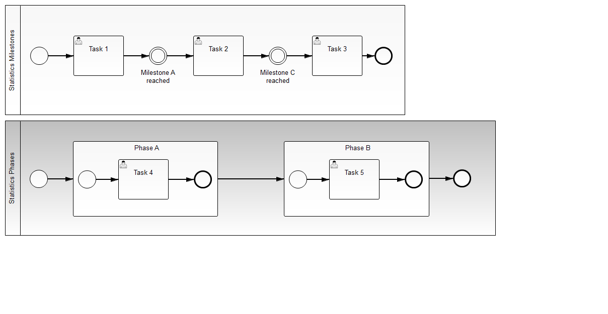
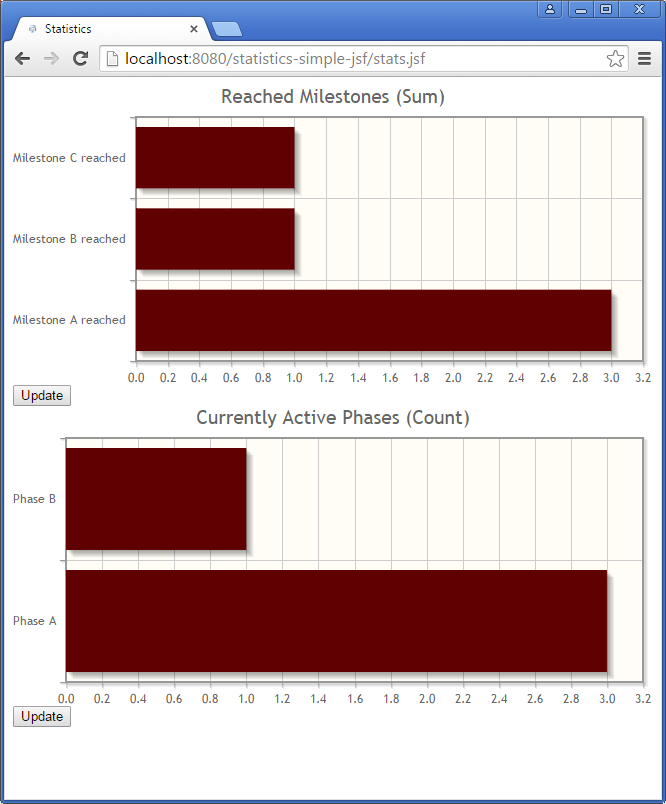

Statistics for milestones
=========================

This example shows how you can easily draw a chart (using the free jqplot library) showing the number of passed milestones or the current phase of a process instance.

The information is taken 100% from the BPMN process model:

And visualized as a bar chart:

How does it work?
-----------------

How to use it?
--------------

Build the project and deploy the WAR on JBoss AS 7 or Wildfly (as JSF is used you need a server capable of JSF).

Go to [http://localhost:8080/statistics-simple-jsf/stats.jsf](http://localhost:8080/statistics-simple-jsf/stats.jsf) to see the statistics (empty at the beginning).

You can start processes by using [Camunda Tasklist](http://docs.camunda.org/latest/guides/user-guide/#tasklist) - then the statistic changes.

Environment Restrictions
------------------------

Built and tested against Camunda BPM version 7.2.0 on JBoss AS.

License
-------

[Apache License, Version 2.0](http://www.apache.org/licenses/LICENSE-2.0).
