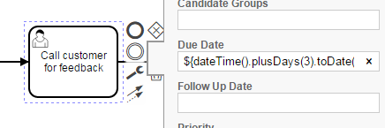

**NOTE: The described use case may be better handled with the [Timeout Task Listener](https://docs.camunda.org/manual/7.12/user-guide/process-engine/delegation-code/#task-listener-event-lifecycle) that was introduced in Camunda 7.12**

Watch Task Due Date and Automatically Take Action
======================

This Snippet contains a [Process Engine Plugin](https://docs.camunda.org/manual/latest/user-guide/process-engine/process-engine-plugins/) that adds functionality to automatically escalate overdue Jobs by a custom Job Handler.

In your process model you just make sure that you set the *due date* of a User Task correctly:

Show me the important parts!
----------------------------

* The [Process Engine Plugin](src/main/java/com/camunda/demo/task/escalation/WatchUserTaskDueDateProcessEnginePlugin.java) to add
* A [Parse Listener](src/main/java/com/camunda/demo/task/escalation/AddWatchDuedateParseListener.java) which adds Task Listeners to create or remove the job: [CreateWatchDuedateJobTaskListener](src/main/java/com/camunda/demo/task/escalation/CreateWatchDuedateJobTaskListener.java), [DeleteWatchDuedateJobTaskListener](src/main/java/com/camunda/demo/task/escalation/DeleteWatchDuedateJobTaskListener.java)
* A [Job Handler](src/main/java/com/camunda/demo/task/escalation/UserTaskOverdueJobHandler.java) taking arbritrary actions when the task is now overdue

How to use it?
--------------

* Build it via Maven
* Configure the Process Engine to use the Plugin

Environment Restrictions
------------------------

Built and tested against Camunda BPM version 7.4.0

License
-------

[Apache License, Version 2.0](http://www.apache.org/licenses/LICENSE-2.0).
