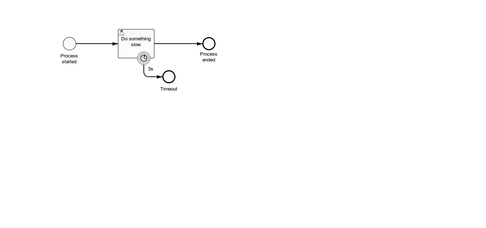

# Task Query including Timeouts
A Process Application that illustrates how to query for User Tasks whose attached Boundary Timer Event has fired.

This project has been generated by the Maven archetype
[camunda-archetype-servlet-war-7.4.0](http://docs.camunda.org/latest/guides/user-guide/#process-applications-maven-project-templates-archetypes).

## Show me the important parts!


## How does it work?

```sql
-- id of first boundaryEvent that is attached to a given task
-- <bpmn:boundaryEvent id="BoundaryEvent_1" name="5s" attachedToRef="UserTask_1" cancelActivity="false">
-- explain analyze
select regexp_replace(utf8tostring( BA.BYTES_ ), '(?s).*<[^>]*boundaryEvent[^>]+id="([^"]+)"[^>]+attachedToRef="UserTask_1"[^>]*>.*', '$1') from ACT_GE_BYTEARRAY as BA where locate('"BoundaryEvent_1"', utf8tostring( BA.BYTES_ ) ) > 0 and locate('UserTask_1', utf8tostring( BA.BYTES_ ) ) > 0

-- id of task to which boundary event is attached
-- <bpmn:boundaryEvent id="BoundaryEvent_1" name="5s" attachedToRef="UserTask_1" cancelActivity="false">
-- explain analyze
select regexp_replace(utf8tostring( BA.BYTES_ ), '(?s).*<[^>]*boundaryEvent[^>]+id="BoundaryEvent_1"[^>]+attachedToRef="([^"]+)"[^>]*>.*', '$1') from ACT_GE_BYTEARRAY as BA where locate('"BoundaryEvent_1"', utf8tostring( BA.BYTES_ ) ) > 0 and locate('UserTask_1', utf8tostring( BA.BYTES_ ) ) > 0

-- all user tasks that have at least one boundary event
-- explain analyze
select * from ACT_HI_TASKINST as TI
join ACT_RE_PROCDEF as PD on PROC_DEF_ID_ = PD.ID_
join ACT_GE_BYTEARRAY as BA on PD.DEPLOYMENT_ID_ = BA.DEPLOYMENT_ID_  and PD.RESOURCE_NAME_ = BA.NAME_ 
--join ACT_HI_ACTINST as AI on TI.EXECUTION_ID_ = AI.EXECUTION_ID_ and AI.ACT_ID_ = 
where locate('boundaryEvent', utf8tostring( BA.BYTES_ ) ) > 0


-- <bpmn:boundaryEvent id="BoundaryEvent_1" name="5s" attachedToRef="UserTask_1" cancelActivity="false">
-- explain analyze
select * from ACT_HI_TASKINST as TI
--join ACT_RE_PROCDEF as PD on TI.PROC_DEF_ID_ = PD.ID_
--join ACT_GE_BYTEARRAY as BA on PD.DEPLOYMENT_ID_ = BA.DEPLOYMENT_ID_  and PD.RESOURCE_NAME_ = BA.NAME_ 
join ACT_HI_ACTINST as AI on TI.EXECUTION_ID_ = AI.EXECUTION_ID_ --and AI.ACT_ID_ = regexp_replace(utf8tostring( BA.BYTES_ ), '(?s).*<[^>]*boundaryEvent[^>]+id="([^"]+)"[^>]+attachedToRef="UserTask_1"[^>]*>.*', '$1')
where --locate('boundaryEvent', utf8tostring( BA.BYTES_ ) ) > 0
--and 
AI.ACT_TYPE_ = 'boundaryTimer' 


-- <bpmn:boundaryEvent id="BoundaryEvent_1" name="5s" attachedToRef="UserTask_1" cancelActivity="false">
-- explain analyze
select * from ACT_HI_TASKINST as TI
join ACT_RE_PROCDEF as PD on TI.PROC_DEF_ID_ = PD.ID_
join ACT_GE_BYTEARRAY as BA on PD.DEPLOYMENT_ID_ = BA.DEPLOYMENT_ID_  and PD.RESOURCE_NAME_ = BA.NAME_ 
join ACT_HI_ACTINST as AI on TI.EXECUTION_ID_ = AI.EXECUTION_ID_ and AI.ACT_ID_ = regexp_replace(utf8tostring( BA.BYTES_ ), '(?s).*<[^>]*boundaryEvent[^>]+id="([^"]+)"[^>]+attachedToRef="UserTask_1"[^>]*>.*', '$1')
where locate('boundaryEvent', utf8tostring( BA.BYTES_ ) ) > 0
and  AI.ACT_TYPE_ = 'boundaryTimer'

-- <bpmn:boundaryEvent id="BoundaryEvent_1" name="5s" attachedToRef="UserTask_1" cancelActivity="false">
-- explain analyze
select * from ACT_HI_TASKINST as TI
--join ACT_RE_PROCDEF as PD on TI.PROC_DEF_ID_ = PD.ID_
--join ACT_GE_BYTEARRAY as BA on PD.DEPLOYMENT_ID_ = BA.DEPLOYMENT_ID_  and PD.RESOURCE_NAME_ = BA.NAME_ 
right join ACT_HI_ACTINST as AI on TI.EXECUTION_ID_ = AI.EXECUTION_ID_ --and AI.ACT_ID_ = regexp_replace(utf8tostring( BA.BYTES_ ), '(?s).*<[^>]*boundaryEvent[^>]+id="([^"]+)"[^>]+attachedToRef="UserTask_1"[^>]*>.*', '$1')
where AI.ACT_TYPE_ = 'boundaryTimer'
--and locate('boundaryEvent', utf8tostring( BA.BYTES_ ) ) > 0
  
-- <bpmn:boundaryEvent id="BoundaryEvent_1" name="5s" attachedToRef="UserTask_1" cancelActivity="false">
-- explain analyze
select * from ACT_HI_TASKINST as TI
join ACT_RE_PROCDEF as PD on TI.PROC_DEF_ID_ = PD.ID_
join ACT_GE_BYTEARRAY as BA on PD.DEPLOYMENT_ID_ = BA.DEPLOYMENT_ID_  and PD.RESOURCE_NAME_ = BA.NAME_ 
right join ACT_HI_ACTINST as AI on TI.EXECUTION_ID_ = AI.EXECUTION_ID_ --and AI.ACT_ID_ = regexp_replace(utf8tostring( BA.BYTES_ ), '(?s).*<[^>]*boundaryEvent[^>]+id="([^"]+)"[^>]+attachedToRef="UserTask_1"[^>]*>.*', '$1')
where AI.ACT_TYPE_ = 'boundaryTimer'
--and locate('boundaryEvent', utf8tostring( BA.BYTES_ ) ) > 0
  

-- explain analyze
select * from ACT_HI_ACTINST as AI
-- ACT_HI_TASKINST as TI
join ACT_RE_PROCDEF as PD on AI.PROC_DEF_ID_ = PD.ID_
join ACT_GE_BYTEARRAY as BA on PD.DEPLOYMENT_ID_ = BA.DEPLOYMENT_ID_  and PD.RESOURCE_NAME_ = BA.NAME_ 
--right join ACT_HI_ACTINST as AI on TI.EXECUTION_ID_ = AI.EXECUTION_ID_ --and AI.ACT_ID_ = regexp_replace(utf8tostring( BA.BYTES_ ), '(?s).*<[^>]*boundaryEvent[^>]+id="([^"]+)"[^>]+attachedToRef="UserTask_1"[^>]*>.*', '$1')
where AI.ACT_TYPE_ = 'boundaryTimer'
--and locate('boundaryEvent', utf8tostring( BA.BYTES_ ) ) > 0

-- user tasks that have a boundary timer event that has fired
-- explain analyze
select TI.* from ACT_HI_ACTINST as AI
join ACT_RE_PROCDEF as PD on AI.PROC_DEF_ID_ = PD.ID_
join ACT_GE_BYTEARRAY as BA on PD.DEPLOYMENT_ID_ = BA.DEPLOYMENT_ID_ and PD.RESOURCE_NAME_ = BA.NAME_ 
join ACT_HI_TASKINST as TI on AI.PROC_INST_ID_ = TI.PROC_INST_ID_ and TI.TASK_DEF_KEY_  = regexp_replace(utf8tostring( BA.BYTES_ ), '(?s).*<[^>]*boundaryEvent[^>]+id="' || AI.ACT_ID_ || '"[^>]+attachedToRef="([^"]+)"[^>]*>.*', '$1')
where AI.ACT_TYPE_ = 'boundaryTimer'

```


## How to use it?
There is no web interface to access the application.
To get started refer to the `InMemoryH2Test`.

You can also use `ant` to build and deploy the example to an application server.
For that to work you need to copy the file `build.properties.example` to `build.properties`
and configure the path to your application server inside it.
Alternatively, you can also copy it to `${user.home}/.camunda/build.properties`
to have a central configuration that works with all projects generated by the
[Camunda BPM Maven Archetypes](http://docs.camunda.org/latest/guides/user-guide/#process-applications-maven-project-templates-archetypes).

Once you deployed the application you can run it using
[Camunda Tasklist](http://docs.camunda.org/latest/guides/user-guide/#tasklist)
and inspect it using
[Camunda Cockpit](http://docs.camunda.org/latest/guides/user-guide/#cockpit).

## Environment Restrictions
Built and tested against Camunda BPM version 7.4.0.

## Known Limitations

## Improvements Backlog

## License
[Apache License, Version 2.0](http://www.apache.org/licenses/LICENSE-2.0).

<!-- HTML snippet for index page
  <tr>
    <td></td>
    <td><a href="snippets/task-query-including-timeouts">Task Query including Timeouts</a></td>
    <td>A Process Application that illustrates how to query for User Tasks whose attached Boundary Timer Event has fired.</td>
  </tr>
-->