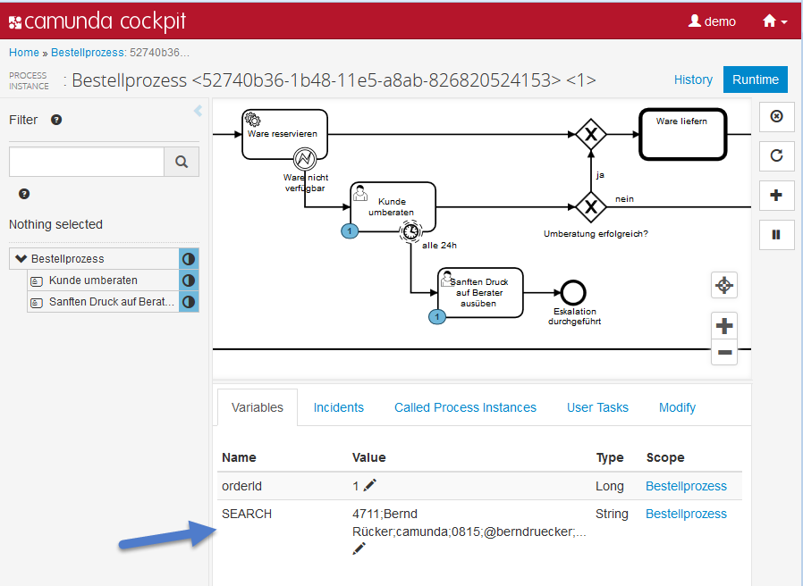

Tasklist Plugin "Easy Search"
=========================

This plugin shows how to replace the existing, really powerfull search, by a more simple one, which just takes one input string and starts to search (as we all know this from Google). 

As we do not have a complete search index in the background we have to specify how to search for this field.

This plugin leverages a simple trick: *Create a special process variable 'SEARCH'*.

You can fill this variable with all data that should be searchable, so e.g. 'CustomerId,CustomerName,OrderId,Email,...' as one concatinated string. That allows to easily search through it via the "LIKE" operator.

Please note that this trick is limited in its power and might not work well with huge amounts of data. However - it is often sufficient or at least usable to showcase possibilities, you can still exchange the backend fuctionality by a "real" search, e.g. based on Elasticsearch (see also [https://github.com/camunda/camunda-bpm-elasticsearch](Community Extension for ElasticSearch)).

How to use it?
--------------

You can use `ant` to build and install the plugin to an existing camunda webapp
inside an application server.
For that to work you need to copy the file `build.properties.example` to `build.properties`
and configure the path to your application server inside it.
Alternatively, you can also copy it to `${user.home}/.camunda/build.properties`
to have a central configuration that works with all projects generated by the
[Camunda BPM Maven Archetypes](http://docs.camunda.org/latest/guides/user-guide/#process-applications-maven-project-templates-archetypes).

Once you installed the plugin it should appear in
[Camunda Tasklist](http://docs.camunda.org/latest/guides/user-guide/#tasklist).

Environment Restrictions
------------------------

Built and tested against Camunda BPM version 7.3.0.

Improvements Backlog
--------------------

* Improve Layout

License
-------

[Apache License, Version 2.0](http://www.apache.org/licenses/LICENSE-2.0).
