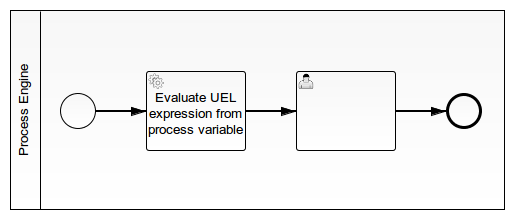

UEL Variable Evaluator
======================

This example shows how to evaluate an expression written in Unified Expression Language (UEL)
that is stored in a process variable.

This can be used to pass expressions as parameters, e.g. to Call Activities,
and therefore make CDI and Spring beans configurable.

This project has been generated by the Maven archetype
[camunda-archetype-ejb-war-7.1.3-SNAPSHOT](https://docs.camunda.org/manual/latest/user-guide/process-applications/maven-archetypes/).


Show me the important parts!
----------------------------



The Service Task uses the following expression: `${uel.evaluate(execution, expression)}`


How does it work?
-----------------

`uel` is a named bean that parses and evaluates the expression:

```java
@Named("uel")
public class UEL {

  public Object evaluate(DelegateExecution execution, String expression) {
    ExpressionManager expressionManager = Context.getProcessEngineConfiguration().getExpressionManager();
    return expressionManager.createExpression(expression).getValue(execution);
  }
}
```

How to use it?
--------------

There is no web interface to access the application.
To get started refer to the `InMemoryH2Test`.

There is also an `ArquillianTest`, which by default connects to a
Camunda BPM platform running locally on a JBoss AS 7.
You can download a Camunda BPM distribution for JBoss from the
[Camunda BPM download page](http://camunda.org/download/).


Environment Restrictions
------------------------

Built and tested against Camunda BPM version 7.1.0-Final.


Known Issues
------------


Improvements Backlog
--------------------


License
-------

[Apache License, Version 2.0](http://www.apache.org/licenses/LICENSE-2.0).